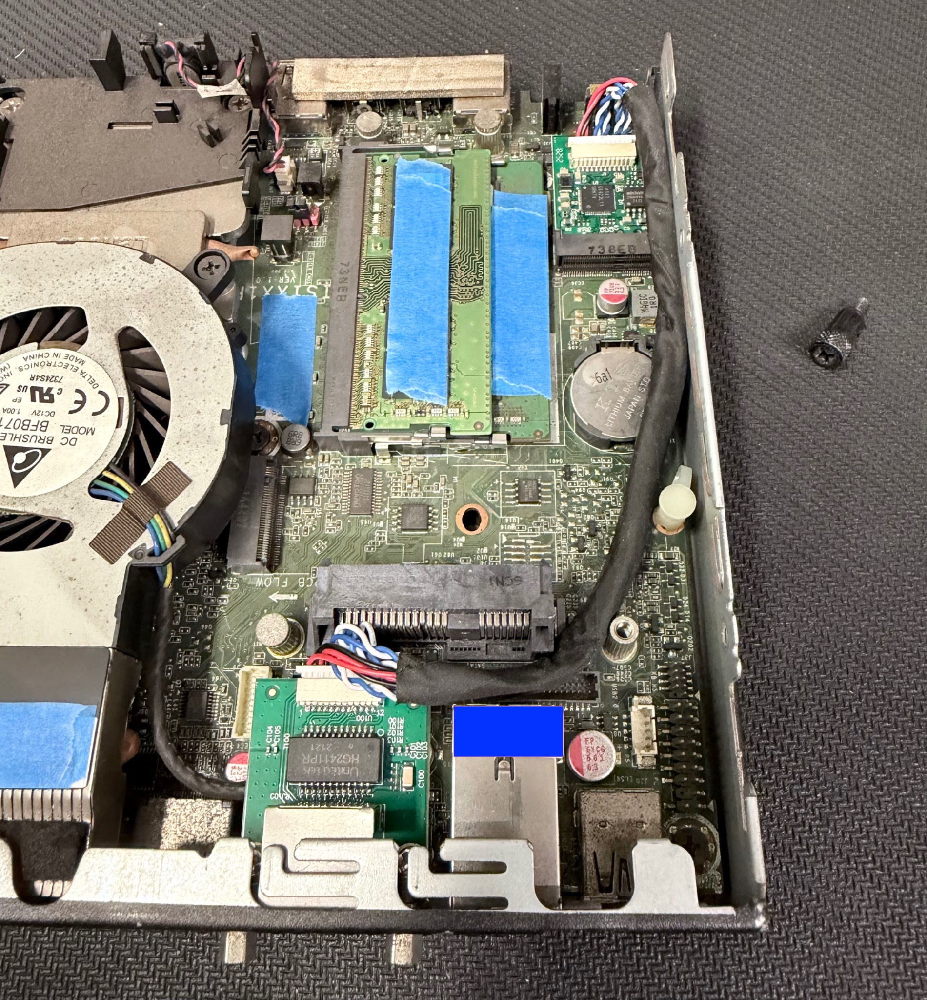
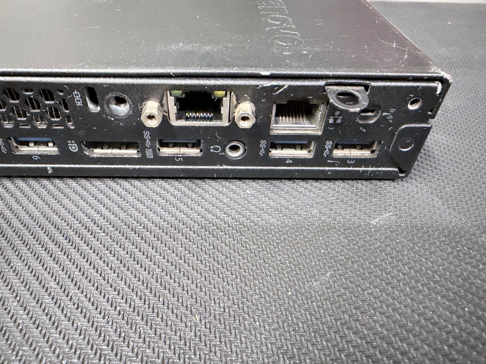

# Hardware Preparation and pfSense Installation

This guide documents how I converted a **Lenovo ThinkCentre Tiny** into a dedicated **pfSense firewall/router** for my homelab.

Rather than purchasing a dedicated firewall appliance, I repurposed an existing small-form-factor business computer and upgraded the hardware to create a capable network appliance.

The deployment included:

1. Evaluating the existing ThinkCentre hardware
2. Upgrading the memory from 8 GB to 16 GB
3. Replacing the existing storage with a Kingston SSD
4. Installing a second Ethernet interface
5. Preparing a bootable pfSense USB installer
6. Wiping the previous operating system
7. Installing pfSense
8. Assigning WAN and LAN interfaces
9. Completing the initial pfSense setup wizard
10. Accessing the firewall through the webConfigurator
11. Validating basic network connectivity

> **Public Portfolio Note:** IP addresses, hostnames, usernames, WAN addresses, and other infrastructure identifiers shown throughout this repository are sanitized examples and do not represent the live homelab configuration.

---

# 1. Why the Lenovo ThinkCentre?

A Lenovo ThinkCentre Tiny was repurposed as the dedicated firewall/router for the homelab.

Small-form-factor business computers are useful for this type of project because they can provide:

* x86-64 architecture
* Low power consumption
* Replaceable memory
* Replaceable storage
* Compact physical dimensions
* USB boot support
* Multiple expansion options
* Compatibility with FreeBSD-based operating systems
* More processing capability than many basic consumer routers

The ThinkCentre also fits inside the custom **10-inch 5U rack** created for the physical infrastructure portion of the homelab.

The physical rack build is documented separately:

**[Homelab Physical Infrastructure](https://github.com/Acoz98/homelab-physical-infrastructure)**

---

# 2. Hardware Upgrades

Before deploying pfSense, I upgraded the ThinkCentre to provide additional resources and prepare the computer for long-term use as a dedicated network appliance.

The objective was not simply to meet the minimum requirements for pfSense.

I wanted the system to have enough capacity for future additions such as:

* Additional VLANs
* Firewall policies
* DHCP services
* VPN services
* Network monitoring
* Additional pfSense packages
* Increased inter-VLAN traffic
* Future security experimentation

---

## Memory Upgrade

The ThinkCentre originally contained:

```text
8 GB RAM
```

The system was upgraded to:

```text
16 GB RAM
```

The upgrade provides additional memory headroom for the firewall and future services.

```text
Original Configuration

8 GB RAM
    │
    ▼
Memory Upgrade
    │
    ▼
16 GB RAM
```

pfSense can operate with considerably less memory for many home and small-lab environments, but increasing the available RAM gives the platform additional capacity as the homelab grows.

---

## Storage Upgrade

The original storage device was also replaced with a **Kingston 500 GB SSD **.

The SSD became the dedicated storage device for the firewall operating system.

It provides storage for:

* pfSense
* Configuration files
* System logs
* Installed packages
* Firewall-related services

Because this computer was being converted into a dedicated firewall appliance, the previous operating system and existing data were no longer required.

The system would eventually be completely wiped before installing pfSense.

---

## Hardware Upgrade Evidence

The ThinkCentre was opened to inspect the internal components and perform the required upgrades.



*Internal view of the Lenovo ThinkCentre during hardware preparation and upgrade.*

> **Privacy Note:** Hardware identifiers, serial numbers, MAC addresses, and similar identifiers should be removed or obscured before publishing hardware photographs.

---

## Final Hardware Configuration

After the upgrades, the firewall platform consisted of:

| Component           | Configuration                  |
| ------------------- | ------------------------------ |
| Platform            | Lenovo ThinkCentre Tiny        |
| Memory              | 16 GB RAM                      |
| Storage             | Kingston 500 GB SSD            |
| Ethernet Interfaces | 2 physical Ethernet interfaces |
| Additional NIC      | Intel I226-V 2.5 GbE           |
| Operating System    | pfSense                        |
| Primary Role        | Firewall / Router              |

With upgraded memory, SSD storage, and two dedicated network interfaces, the ThinkCentre provided more than enough resources for the current homelab routing and firewall workload while leaving room for future expansion.

---

# 3. Why Two Network Interfaces Are Needed

A firewall/router needs to communicate with at least two different sides of the network.

At the most basic level:

```text
Internet
   │
   │
  WAN
   │
   ▼
┌─────────────────┐
│                 │
│     pfSense     │
│   ThinkCentre   │
│                 │
└────────┬────────┘
         │
        LAN
         │
         ▼
 Internal Network
```

The **WAN interface** communicates with the upstream Internet connection.

The **LAN interface** communicates with the internal network.

The ThinkCentre already contained one built-in Ethernet interface.

A second Ethernet interface therefore had to be added.

---

# 4. Additional Network Interface

For the additional network connection, I purchased an **M.2 A+E Key 2.5 GbE Ethernet adapter using an Intel I226-V controller**.

## NIC Specifications

| Specification       | Configuration                |
| ------------------- | ---------------------------- |
| Interface           | M.2 A+E Key                  |
| Ethernet Controller | Intel I226-V                 |
| Ethernet Port       | 1 × RJ45                     |
| Maximum Speed       | 2.5 GbE                      |
| Supported Speeds    | 100 Mbps / 1 Gbps / 2.5 Gbps |
| Media               | Copper Ethernet              |

### Product Used

[Amazon — M.2 A+E Key Intel I226-V 2.5 GbE NIC](https://www.amazon.com/dp/B0GHDJDMN2)

The exact adapter used in this build is **not required** to reproduce the project.

A compatible network adapter supported by the pfSense/FreeBSD version being installed can be substituted.

---

# 5. Why I Selected an Intel-Based NIC

pfSense is based on FreeBSD.

Because of this, network interface compatibility and driver support are important considerations when selecting hardware.

Intel-based Ethernet controllers are commonly used in pfSense systems because of their strong FreeBSD driver support and reliability.

Before purchasing an Ethernet adapter for your own system, verify that the specific chipset is supported by the version of pfSense you plan to install.

Official hardware guidance:

[pfSense Hardware Documentation](https://docs.netgate.com/pfsense/en/latest/hardware/)

> Do not assume that an Ethernet adapter that works in Windows or Linux will automatically provide ideal compatibility with pfSense. Always verify FreeBSD driver support first.

---

# 6. Install the Additional NIC

Before modifying the ThinkCentre:

1. Shut down the computer.
2. Disconnect the power adapter.
3. Disconnect Ethernet and peripheral cables.
4. Open the ThinkCentre chassis.
5. Identify the compatible M.2 slot.
6. Verify that the slot supports the required interface.
7. Install the M.2 Ethernet adapter.
8. Secure the adapter.
9. Route the Ethernet connection carefully through the chassis.
10. Install the external RJ45 connection.
11. Inspect the cable routing.
12. Reassemble the computer.

After installation, the ThinkCentre contained two physical Ethernet interfaces.

```text
Lenovo ThinkCentre
│
├── Built-in Ethernet
│
└── Intel I226-V 2.5 GbE Ethernet
```

These interfaces could now be assigned separate **WAN** and **LAN** roles inside pfSense.

---

## Network Interface Evidence

The completed system provides two physical Ethernet interfaces.



*Rear network interfaces after adding the second Ethernet connection.*

---

# 7. Verify the Hardware

Before wiping the computer and installing pfSense, verify that the hardware is operating correctly.

Check:

* [ ] ThinkCentre powers on normally
* [ ] BIOS/UEFI can be accessed
* [ ] 16 GB of memory is detected
* [ ] Kingston 500 GB SSD is detected
* [ ] Built-in Ethernet interface is available
* [ ] Additional Ethernet interface is detected
* [ ] Additional NIC is physically secure
* [ ] USB boot is available
* [ ] Cooling system is functioning
* [ ] Ventilation is unobstructed

If the second network interface is not detected, investigate:

* M.2 slot compatibility
* BIOS settings
* Adapter seating
* Hardware revision
* FreeBSD driver support
* NIC chipset compatibility

Do not continue with the firewall installation until the required hardware is functioning correctly.

---

# 8. Prepare the pfSense Installation Media

A USB flash drive was used to install pfSense onto the ThinkCentre.

## Requirements

For a similar installation, you will need:

* Compatible x86-64 computer
* Two compatible Ethernet interfaces
* Internal storage device
* USB flash drive
* Separate computer for preparing the installer
* Keyboard
* Monitor
* Ethernet cables

Download the appropriate pfSense installer using the official Netgate/pfSense installation resources.

> Always obtain firewall installation media from the official source rather than an unknown third-party download site.

Write the downloaded pfSense image to the USB flash drive using an appropriate disk-imaging utility.

Common tools include:

* balenaEtcher
* Rufus
* Other raw disk-image writing utilities

The exact imaging software is not important as long as the pfSense installer is correctly written to the USB drive.

---

# 9. Boot the ThinkCentre From USB

Insert the prepared pfSense USB drive into the ThinkCentre.

Power on the system.

Enter the system boot menu or BIOS/UEFI configuration.

Select the USB flash drive as the boot device.

The system should begin loading the pfSense installer.

Conceptually:

```text
ThinkCentre
     │
     ▼
BIOS / UEFI
     │
     ▼
USB Boot Device
     │
     ▼
pfSense Installer
```

---

# 10. Wipe the Existing Computer

The ThinkCentre was being converted into a dedicated firewall appliance.

Because the previous operating system was no longer required, the internal storage was wiped during the pfSense installation.

> **Warning:** Installing pfSense onto the internal storage device can permanently erase the existing operating system and stored data.

Back up any important information before proceeding.

The Kingston SSD was selected as the installation destination.

The previous operating system and partitions were removed.

pfSense was then installed directly onto the SSD.

---

# 11. Complete the pfSense Installation

Follow the pfSense installation process displayed on the local monitor.

The installer prepares the internal drive and installs the firewall operating system.

After installation completes:

1. Shut down or reboot the system when instructed.
2. Remove the USB installation media.
3. Allow the ThinkCentre to boot from the internal Kingston SSD.

The system should now load directly into pfSense.

---

# 12. First pfSense Boot

After rebooting, pfSense detects the available Ethernet interfaces.

In this build, the available interfaces corresponded to:

```text
Built-in ThinkCentre Ethernet

Intel I226-V 2.5 GbE Ethernet
```

These interfaces then needed to be assigned network roles.

---

# 13. WAN and LAN Interface Assignment

The two Ethernet connections must be assigned correctly.

## WAN

The **WAN interface** connects toward the upstream network.

This may be:

* ISP modem
* ISP gateway
* Upstream router
* Other Internet-facing device

## LAN

The **LAN interface** connects toward the trusted internal network.

This may initially be:

* A management computer
* Managed switch
* Trusted internal device

Conceptually:

```text
                Internet
                   │
                   ▼
            Upstream Device
                   │
                  WAN
                   │
          ┌─────────────────┐
          │                 │
          │     pfSense     │
          │   ThinkCentre   │
          │                 │
          └────────┬────────┘
                   │
                  LAN
                   │
                   ▼
            Internal Network
```

For the initial setup, keep the environment simple.

Do not immediately introduce VLANs, servers, wireless devices, and other network components.

First verify that the basic firewall is functioning correctly.

---

# 14. Initial pfSense Configuration

After pfSense was installed and the interfaces were assigned, the initial configuration was completed using the setup process presented during the first launch.

The configuration establishes the basic network settings required to manage the firewall.

For this public documentation, the management network is represented as:

```text
Management Network

10.10.10.0/24
```

The pfSense LAN gateway is represented as:

```text
10.10.10.1
```

This is a **sanitized example network** and does not represent the live homelab addressing.

---

# 15. Connect a Management Computer

Connect a trusted computer to the pfSense LAN interface.

The basic topology should now look similar to:

```text
Internet
   │
   ▼
pfSense WAN
   │
┌─────────────────┐
│     pfSense     │
│   ThinkCentre   │
└────────┬────────┘
         │
         │ LAN
         │
         ▼
 Management PC
```

If DHCP is available on the LAN interface, the management computer should receive an address automatically.

Example:

```text
pfSense LAN

10.10.10.1
     │
     ▼
Management Client

10.10.10.100
```

The specific client address can vary.

The important requirement is that the client belongs to the same LAN subnet.

---

# 16. Verify the Client Address

Verify that the connected management computer received an address.

### Windows

```powershell
ipconfig
```

### Linux

```bash
ip addr
```

### macOS

```bash
ifconfig
```

Verify that the client has:

* An IP address in the LAN subnet
* The pfSense LAN interface as its default gateway
* Connectivity to the firewall

---

# 17. Access the pfSense Web Interface

Once basic LAN connectivity is established, pfSense can be administered through its web interface.

Open a web browser from the management computer.

Navigate to the pfSense LAN address.

Using the sanitized addressing in this documentation:

```text
https://10.10.10.1
```

This opens the **pfSense webConfigurator**.

The webConfigurator becomes the primary management interface for the firewall.

```text
Management Computer
        │
        │ HTTPS
        ▼
https://10.10.10.1
        │
        ▼
pfSense webConfigurator
```

---

# 18. Complete the Initial Setup Wizard

On the first login, pfSense presents an initial setup wizard.

The wizard allows the administrator to configure the fundamental firewall settings.

Typical configuration includes:

1. Hostname
2. Domain
3. DNS settings
4. Time zone
5. WAN configuration
6. LAN configuration
7. Administrative credentials

For the initial deployment, the WAN side received addressing from the upstream network.

The LAN was configured as the trusted management network.

For this public documentation:

```text
WAN

Addressing:
DHCP from upstream network
```

```text
LAN

Network:
10.10.10.0/24

Gateway:
10.10.10.1
```

For diagrams requiring an example WAN address, this repository uses documentation-only addressing:

```text
WAN Address:
192.0.2.10

Upstream Gateway:
192.0.2.1
```

The `192.0.2.0/24` network is used here only for documentation and does not represent the live WAN configuration.

---

# 19. Initial Network Topology

At this point, the firewall deployment looks approximately like:

```text
                     Internet
                        │
                        ▼
                Upstream Gateway
                 192.0.2.1
                        │
                        │
                       WAN
                  192.0.2.10
                        │
              ┌─────────────────┐
              │                 │
              │     pfSense     │
              │   ThinkCentre   │
              │                 │
              └────────┬────────┘
                       │
                      LAN
                  10.10.10.1
                       │
                       ▼
              Management Client
                 10.10.10.x
```

At this stage, the ThinkCentre has successfully been converted from a general-purpose computer into a dedicated firewall/router.

---

# 20. Initial Validation

Before introducing the managed switch, VLANs, servers, Raspberry Pi, or wireless infrastructure, validate the basic firewall deployment.

## Firewall Validation

Verify:

* [ ] pfSense boots from the Kingston SSD
* [ ] 16 GB RAM is detected
* [ ] Both Ethernet interfaces are detected
* [ ] WAN interface is assigned correctly
* [ ] LAN interface is assigned correctly
* [ ] WAN receives addressing
* [ ] LAN has the expected gateway address
* [ ] pfSense webConfigurator is accessible

## Management Client Validation

Verify:

* [ ] Client receives a LAN IP address
* [ ] Client can reach the pfSense gateway
* [ ] Client can access the pfSense web interface
* [ ] Client can reach the Internet
* [ ] DNS resolution functions correctly

---

# 21. Test Gateway Connectivity

From the management computer, test connectivity to the firewall.

```bash
ping 10.10.10.1
```

Successful replies confirm that the management computer can communicate with the pfSense LAN interface.

---

# 22. Test Internet Connectivity

Next, test connectivity beyond the firewall.

For example:

```bash
ping 1.1.1.1
```

Successful replies demonstrate that traffic can travel:

```text
Management Client
        │
        ▼
pfSense LAN
        │
        ▼
Firewall / NAT
        │
        ▼
pfSense WAN
        │
        ▼
Internet
```

---

# 23. Test DNS Resolution

Finally, verify DNS functionality.

Example:

```bash
nslookup example.com
```

A successful response confirms that the client can resolve domain names.

At this point, the basic firewall deployment is operational.

---

# 24. What Was Accomplished

This stage of the homelab demonstrates:

### Hardware

* Small-form-factor computer repurposing
* Hardware inspection
* Memory upgrade
* Storage replacement
* SSD deployment
* M.2 expansion
* Additional Ethernet interface installation
* NIC compatibility research
* Intel Ethernet hardware integration

### System Deployment

* BIOS/UEFI interaction
* USB installation media preparation
* Existing operating system removal
* Dedicated firewall operating system installation
* pfSense deployment

### Networking

* WAN/LAN architecture
* Physical network interface assignment
* IPv4 subnetting
* Private address planning
* DHCP client connectivity
* Gateway configuration
* NAT connectivity
* DNS validation
* Basic network troubleshooting

### Administration

* pfSense webConfigurator
* Browser-based firewall administration
* Initial firewall wizard configuration
* Technical validation
* Documentation

---

# 25. Why This Approach Was Chosen

The goal was not simply to install pfSense.

The objective was to transform an existing business computer into a dedicated and expandable network appliance.

Instead of purchasing new firewall hardware, the existing ThinkCentre was:

```text
Existing ThinkCentre
        │
        ▼
Hardware Inspection
        │
        ├── RAM Upgrade
        │      8 GB → 16 GB
        │
        ├── Kingston SSD
        │
        └── Intel I226-V NIC
        │
        ▼
Storage Wiped
        │
        ▼
pfSense Installed
        │
        ▼
WAN / LAN Configured
        │
        ▼
Dedicated Firewall / Router
```

This approach provided:

* Lower project cost
* Hardware reuse
* Expandability
* More capable hardware than a basic consumer router
* Hands-on hardware experience
* Hands-on networking experience
* A platform for future network segmentation

---

# 26. Build It Yourself

You do not need the exact ThinkCentre or NIC used in this project.

A similar firewall can be built using other compatible x86-64 hardware.

The general process is:

```text
Choose Compatible x86 Hardware
        ↓
Evaluate Existing Resources
        ↓
Upgrade Hardware if Needed
        ↓
Verify pfSense Compatibility
        ↓
Provide Two Ethernet Interfaces
        ↓
Install Additional NIC if Required
        ↓
Prepare pfSense USB Installer
        ↓
Boot From USB
        ↓
Wipe Existing Operating System
        ↓
Install pfSense
        ↓
Assign WAN and LAN
        ↓
Connect Management Computer
        ↓
Access webConfigurator
        ↓
Complete Setup Wizard
        ↓
Validate Gateway Connectivity
        ↓
Validate Internet Access
        ↓
Validate DNS
```

Before purchasing hardware, always verify:

* CPU architecture
* Memory compatibility
* Storage compatibility
* NIC chipset
* FreeBSD driver support
* Expansion-slot compatibility
* Cooling requirements
* Power requirements

---

# 27. Current Result

At the completion of this stage, the Lenovo ThinkCentre is operating as the dedicated firewall/router for the homelab.

The system now provides the foundation for the next layers of the network.

```text
Internet
    │
    ▼
pfSense Firewall
Lenovo ThinkCentre
    │
    ▼
Internal Network
```

The firewall hardware and base installation are now complete.

---

# Next Stage

The next stage connects pfSense to the **NETGEAR managed switch** and introduces network segmentation.

The next portion of the project will document:

* Managed switch integration
* VLAN planning
* VLAN creation
* pfSense VLAN interfaces
* Tagged trunking
* Untagged access ports
* PVID configuration
* DHCP scopes
* Firewall policies
* Inter-VLAN routing
* Network isolation
* Connectivity validation
* Troubleshooting

This will transform the basic WAN/LAN firewall deployment into a segmented homelab network.
